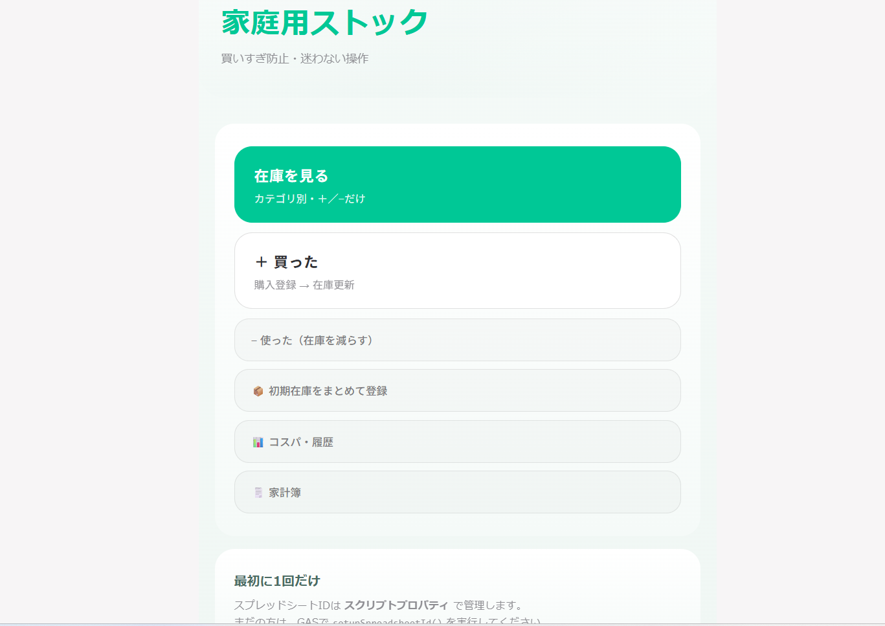
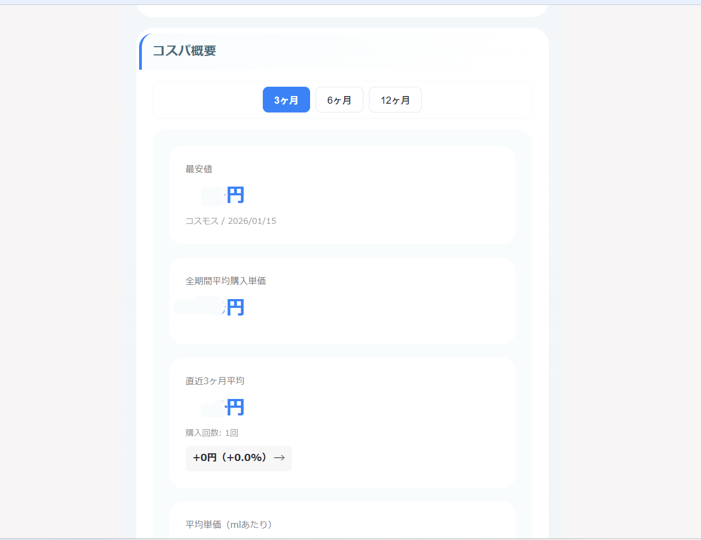

### 📊 くらしログ - 家庭用管理ツール
<div align="center">
**GAS × スプレッドシートで作る、丁寧に続けられる家計管理**

**30〜40代女性向けの在庫管理・家計簿・コスパ分析システム**
</div>

### メイン画面

<div align="center">
  
</div>

### 主要機能

<div align="center">
  
  
  
</div>

### 機能詳細
在庫管理機能 💚

<details>
<summary><strong>在庫管理機能のスクリーンショット</strong></summary>

<div align="center">
  
  
</div>

</details>

左: カテゴリ別在庫一覧。エメラルドグリーンのテーマカラーで統一。＋/−ボタンで直感的に数量を調整。
右: 購入登録画面。購入店舗、商品名など。任意で、カテゴリや容量も登録可。

家計簿機能 💗

<details>
<summary><strong>家計簿機能のスクリーンショット</strong></summary>

<div align="center">
  
  
</div>

</details>

左: カレンダー形式で支出を視覚化。ビビッドピンクで華やか。
右: 光熱費の月別推移グラフ。前年同月比較も可能。

コスパ・履歴機能 💙

<details>
<summary><strong>コスパ・履歴機能のスクリーンショット</strong></summary>

<div align="center">
  
  
</div>

</details>
左: コスパ確認をしたい商品を選択。ロイヤルブルーのテーマカラー。
右: 期間を指定。平均単価、最安値、店舗別比較を一覧表示。


## 💭 開発の背景

> 「家計管理は大切だと分かっているけど、細かいと続けられない💦
> ざっくりだと後から見返せない💦」

この課題を解決するため、**くらしログ**を開発しました。
私自身、プログラミングを学ぶ前から、手書きでコスパノートや家計簿をつけていました。
しかし、「これがデータとして活用できたら、もっと良いのに...」と感じながらも、当時はExcelやスプレッドシートすら苦手で、実現できずにいました💦
そこで、プログラミング学習を決意した際に、**一番最初に作りたい**と思い描いていたのが、この『くらしログ』でした。

### なぜ時短ツールではないのか

多くの方には「ストック商品を個別入力するなんて面倒...」と思われるかもしれません。
しかし、物価が高騰し続ける世の中で、**賢くコスパよく買い物をする**ためには、正確な記録が必要でした。
「安かった気がする」「いつもここで買っているから」という曖昧な判断を減らし、**データに基づいた購入判断**をしたかったのです。

## 🎯 システム概要

### 解決する3つの課題

1. 🛒 **買いすぎ・ダブり買いを防ぐ**
2. 💰 **家計の流れを「見える化」する**
3. 📊 **感覚ではなくデータでコスパを判断する**

### ソリューション
Google Apps Script（GAS）とGoogleスプレッドシートを用いて、**コスト0円**で始められる家庭用管理システムを構築しました。

- **スマートフォンからの操作を前提**とした設計
- **考えなくても使える操作性**と**あとから振り返れるデータ設計**を両立
- 「在庫を見る → 買う → 反映される」までを**自然に記録**できる仕組み


---

## ✨ 主な機能

### 📦 在庫管理機能

<details>
<summary><strong>詳細を見る</strong></summary>

  #### 特徴
- ✅ 商品マスタ・在庫シートによるストック管理
- ✅ ＋/−ボタンで在庫数を直感的に操作（長押しで複数個対応）
- ✅ 購入目安在庫数を設定し、補充タイミングを可視化
- ✅ 購入登録と同時に在庫を自動更新
- ✅ 初期在庫の一括登録機能

#### 設計思想
> 👉 「在庫を見る → 買う → 反映される」までを**考えなくていい設計**

</details>

### 💰 家計簿機能

<details>
<summary><strong>詳細を見る</strong></summary>

  #### 通常支出（変動費）
- ✅ 食費・日用品・外食などを家計簿シートに一元管理
- ✅ レシート単位で登録
- ✅ カレンダー表示で日別支出を可視化
- ✅ 13種類のカテゴリ分類

#### 固定費管理の工夫
**光熱費**
- 専用シート（光熱費シート）で管理
- 月次推移・前年同月比較が可能
- グラフで視覚的に把握

**通信費・家賃・その他**
- 通常支出と同じ「家計簿シート」に記録
- 理由：月額が固定で分析頻度が低いため

#### 保険・税金管理
- 年払い・月払いなど、通常費や固定費とも異なる支払周期に対応
- 自動車保険の過去料金比較機能（更新時のコスパ判断用）

#### 設計思想
> 👉 管理粒度を**用途別に分けた**現実的な家計設計  
> 完璧な家計簿 ≠ 続く家計簿

</details>

### 📊 コスパ・履歴機能

<details>
<summary><strong>詳細を見る</strong></summary>

  #### ストック商品のコスパ分析
- ✅ 在庫管理している商品が対象
- ✅ 3ヶ月／6ヶ月／12ヶ月の平均単価
- ✅ 過去の最安値と購入店舗を表示
- ✅ 店舗別平均単価の比較
- ✅ 商品ごとの購入履歴一覧
- ✅ 内容量ベースの詳細コスパ比較

#### 日常食材のコスパ管理
- ✅ 生鮮食品など、在庫管理対象外の商品に対応
- ✅ 日常食材専用の簡易価格記録
- ✅ 「最近高い／安い」の感覚をデータで補助

#### 設計思想
> 📌 コスパ計算は「購入履歴シート」を正とし、在庫シートは数量管理に専念  
> → 在庫が0でも過去データは保持、分析ロジックがシンプルで壊れにくい
>
> 👉 **全部を管理しすぎない**、続けるための割り切り

</details>

### 🔒 セキュリティ機能

- ✅ パスワード認証（暗号化保存）
- ✅ 自動ログアウト（30分間操作なし）

---

## 🎨 デザインの特徴

30〜40代女性が「使い続けたくなる」デザインを実現：

### 配色コンセプト：大人女子でも可愛い、華やかでシンプルな色使い

地味な入力作業でも「この画面を開いて操作したくなる」ように、機能ごとにテーマカラーを設定：

- 💚 **在庫管理機能**: エメラルドグリーン
- 💙 **コスパ・履歴機能**: ロイヤルブルー  
- 💗 **家計簿機能**: ビビッドピンク

シンプルなベースデザインに、鮮やかな色をポイント使い。ごちゃごちゃ派手にならず、綺麗で華やかな印象を実現しました。

### UI/UX設計

- 📱 **スマホファースト**: モバイル操作に最適化
- 🎯 **直感的な操作**: 入力項目は必要最低限、迷わせないボタン配置
- 🔢 **タップ操作優先**: 数字入力より＋/−ボタンでの操作を重視
- 🌟 **余白を活かした設計**: 見やすく、ストレスのないレイアウト
- 🎨 **メイン操作の視覚的強調**: テーマカラーで重要な操作を際立たせる

---

## 🛠️ 技術スタック

### アーキテクチャ

```
フロントエンド：HTML5 / CSS3 / Vanilla JavaScript
バックエンド  ：Google Apps Script (GAS)
データベース  ：Googleスプレッドシート
ライブラリ    ：Chart.js（グラフ描画）
対応デバイス  ：スマートフォン・PC（レスポンシブ）
```

### なぜVanilla JavaScriptなのか

- 外部フレームワークに依存せず、**軽量で高速**な動作を実現
- GASの制約下でも安定して動作
- 学習コストが低く、保守性が高い

---

## 🎯 技術的なポイント

### 1. スプレッドシート設計の工夫

#### 列名ベースの実装
```javascript
// ❌ 悪い例：列番号で指定
const value = sheet.getRange(row, 3).getValue();

// ✅ 良い例：列名で指定
const value = getColumnValue(sheet, row, '商品名');
```

**メリット**
- 列の並び順を変更しても壊れない
- 可読性が高く、保守しやすい
- 「人が見ても分かる構造」を維持

#### データの正規化
- **商品マスタ**: 商品情報を一元管理
- **店舗マスタ**: 店舗情報を一元管理
- **購入履歴**: トランザクションデータ
- **在庫**: 現在庫数のスナップショット

**設計思想**
> DBの正規化を意識しつつも、「家庭用ツール」としての分かりやすさを優先

### 2. 疎結合な連携設計

```
購入登録 → 購入履歴シート（記録）
         → 在庫シート（数量更新）

コスパ分析 → 購入履歴シートを参照
家計簿 → 家計簿シートを参照
```

**メリット**
- 在庫が0でも購入履歴は残る
- 各機能が独立しており、影響範囲が限定的
- 分析ロジックがシンプルで壊れにくい

### 3. パフォーマンス最適化

- **バッチ処理**: スプレッドシートへの読み書きを最小限に
- **キャッシュ活用**: 頻繁にアクセスするデータをキャッシュ
- **非同期処理**: google.script.runによる非同期通信で快適な操作性

### 4. UX設計の工夫

- **エラーハンドリング**: try-catchで適切な処理と分かりやすいエラーメッセージ
- **ステート管理**: JavaScriptで状態を適切に管理し、スムーズな画面遷移
- **レスポンシブ対応**: スマートフォン・タブレット・PCで最適な表示

---
## 📂 システム構成

<details>
<summary><strong>ファイル構成の詳細を見る</strong></summary>

```
プロジェクト/
│
├── GASファイル (.gs)
│   ├── Code.gs              # 在庫管理機能のメインロジック
│   ├── spreadsheet.gs       # スプレッドシート操作の共通処理
│   ├── utils.gs             # ユーティリティ関数
│   ├── household.gs         # 家計簿機能
│   └── CostPerformance.gs   # コスパ分析・履歴機能
│
├── HTMLファイル
│   ├── index.html              # ホーム画面
│   ├── styles.html             # 共通スタイルシート
│   ├── inventory.html          # 在庫管理画面
│   ├── inventory.js.html       # 在庫管理用JavaScript
│   ├── household_page.html     # 家計簿画面
│   ├── household.js.html       # 家計簿用JavaScript
│   ├── costperformance.html    # コスパ分析画面
│   └── costperformance.js.html # コスパ分析用JavaScript
│
└── 設定ファイル
    └── appsscript.json         # GASマニフェストファイル
```

**総ファイル数**: 14ファイル  
**構成**: バックエンド（GAS）5ファイル、フロントエンド（HTML/CSS/JS）8ファイル、設定1ファイル

</details>

<details>
<summary><strong>データ構造の詳細を見る</strong></summary>

```
Googleスプレッドシート/
│
├── 商品マスタ    # 商品情報の管理（商品ID、商品名、カテゴリなど）
├── 在庫          # 現在庫数の管理（商品ID、現在庫数、最終更新日）
├── 店舗マスタ    # 店舗情報の管理（店舗ID、店舗名）
├── 購入履歴      # 購入データの記録（購入日、店舗、商品、単価、内容量など）
├── 家計簿        # 支出データの記録（日付、金額、カテゴリ、メモなど）
└── 光熱費        # 固定費データの記録（対象月、水道代、ガス代、電気代など）
```

**設計ポイント**:
- マスタとトランザクションを分離
- 列名ベースでデータアクセス（列順変更に強い）
- 人が見ても分かる構造

</details>

## 💡 実装の工夫・学び

### 1. 技術的な学び

#### Google Apps Scriptの特性理解
- import/exportが使えない制約下でのモジュール設計
- グローバルスコープを活用した関数の共有
- google.script.runによる非同期通信の理解

#### スプレッドシートをDBとして扱う
- セル範囲の効率的な読み書き
- 数式との共存（人間が見ても分かる設計）
- トリガー処理の活用

#### Vanilla JavaScriptでのSPA的実装
- 画面遷移の状態管理
- DOMの効率的な操作
- イベント処理の最適化

### 2. 設計上の学び

#### ユーザー中心設計（UCD）
- ターゲットユーザーのペルソナ設定
- 実際の使用シーンを想定した機能設計
- 「完璧」より「続けられる」を優先

#### データモデリング
- マスタとトランザクションの分離
- 正規化と非正規化のバランス
- 分析しやすいデータ構造

#### エラー設計
- ユーザーに優しいエラーメッセージ
- 異常系の想定と対処
- ログ設計による問題の追跡

### 3. プロダクト開発の学び

#### 要件定義の重要性
- 自分自身がユーザーだからこその強み
- 本当に必要な機能の見極め
- MVP（Minimum Viable Product）の考え方

#### 継続的な改善
- 実際に使いながらフィードバックを得る
- 小さな改善を積み重ねる
- ドキュメントの整備

---

## 🚀 今後の拡張予定

### 機能面
- [ ] データのエクスポート機能（CSV、PDF）
- [ ] 月次レポート自動生成
- [ ] 予算設定と使いすぎアラート
- [ ] 購入頻度分析
- [ ] PWA化によるオフライン対応

### 技術面
- [ ] テストコードの充実
- [ ] パフォーマンスのさらなる改善
- [ ] アクセシビリティの向上

---

## 📊 開発情報

- **開発期間**: 約7日間
- **総ファイル数**: 14ファイル
- **総行数**: 約14,000行
- **開発体制**: 個人開発（AI活用）
- **開発環境**: Google Apps Script、Cursor

---

## 🎓 このプロジェクトで得たスキル

### 技術スキル
- ✅ Google Apps Scriptでのフルスタック開発
- ✅ スプレッドシートをデータベースとして活用する設計
- ✅ Vanilla JavaScriptでのSPA的な画面遷移実装
- ✅ レスポンシブWebデザイン
- ✅ Chart.jsを使ったデータ可視化
- ✅ 認証・セキュリティの実装

### 設計・思考スキル
- ✅ ユーザー中心設計（UCD）の実践
- ✅ データモデリング（マスタ設計、正規化）
- ✅ エラーハンドリング設計
- ✅ セキュリティ設計（認証、暗号化）
- ✅ 「完璧」より「実用性」を優先する判断力

### プロジェクト管理
- ✅ 要件定義から実装、テスト、運用までの一貫した開発
- ✅ ユーザーフィードバックを元にした改善サイクル
- ✅ ドキュメント作成とメンテナンス
- ✅ AI（ChatGPT等）を活用した効率的な開発

---

## 💭 開発を通じて得た学びと強み

### ユーザー視点を重視した設計力

当初はAIのOCR機能なども検討しましたが、家計管理やストック商品は**ユーザーごとにやり方も対象も異なります**。

そのため、技術先行ではなく、**「実際に使い続けられるか」を最優先**に設計しました。この判断力は、クライアントのニーズを正確に捉え、本当に価値のあるものを提供する上で不可欠だと考えています。

> **技術的にできること ≠ ユーザーが求めているもの**  
> この視点は、今後のあらゆる開発で活かせる強みです。

### 実務で活かせるスキルセット

『くらしログ』の開発を通じて、以下のスキルを実践的に習得しました：

**技術面**
- Google Apps Scriptでのフルスタック開発
- データベース設計とデータモデリング
- レスポンシブWebデザインの実装
- エラーハンドリングとデバッグ

**プロジェクト管理**
- 要件定義から実装、テスト、運用までの一貫した開発経験
- ユーザーフィードバックを元にした継続的な改善
- ドキュメント作成と保守

**問題解決力**
- 技術的制約の中で最適解を見つける能力
- ユーザー目線での機能取捨選択
- 複雑な要件をシンプルな実装に落とし込む力

### 継続的な成長姿勢

プログラミング未経験からスタートし、**自分が本当に欲しいもの**を形にできたことは大きな自信になりました。

『くらしログ』は私自身が日常的に使用しているため、実際の運用の中で見えてくる課題や改善点を、すぐに開発にフィードバックできます。この**PDCAサイクルを回し続ける姿勢**は、実務においても必ず役立つと考えています。

> 『くらしログ』は、日々の暮らしの中で  
> **「考えなくても、きちんと管理できている」**  
> そんな状態を目指したシステムです。


## 👤 制作者

**[Misako]**
プログラミング未経験からAIエンジニアスキルの習得を目指し、学習を継続中。  
「**ユーザーが本当に必要としているものを作る**」をモットーに、個人開発と実務案件に挑戦しています。

### できること

- Google Apps Script（GAS）を使ったWebアプリケーション開発
- スプレッドシートを活用したデータ管理システム構築
- ユーザー視点に立った要件定義と設計
- レスポンシブ対応のUI/UX設計
- AIツールを活用した効率的な開発

### 今後の目標

- より多くの実務案件を通じた経験値の向上
- Python、JavaScript等のスキルをさらに深化
- ユーザーに寄り添ったシステム開発の継続

## 📩 Contact

ポートフォリオ全体に関するご相談・ご質問は、  
公式LINEまたはプロフィールサイトのお問い合わせフォームよりご連絡ください。

[👉 公式LINEで問い合わせる](https://lin.ee/LQKST5q)

[👉 プロフィールサイト](#準備中)

## 📝 ライセンス
このプロジェクトは個人ポートフォリオ用です。
